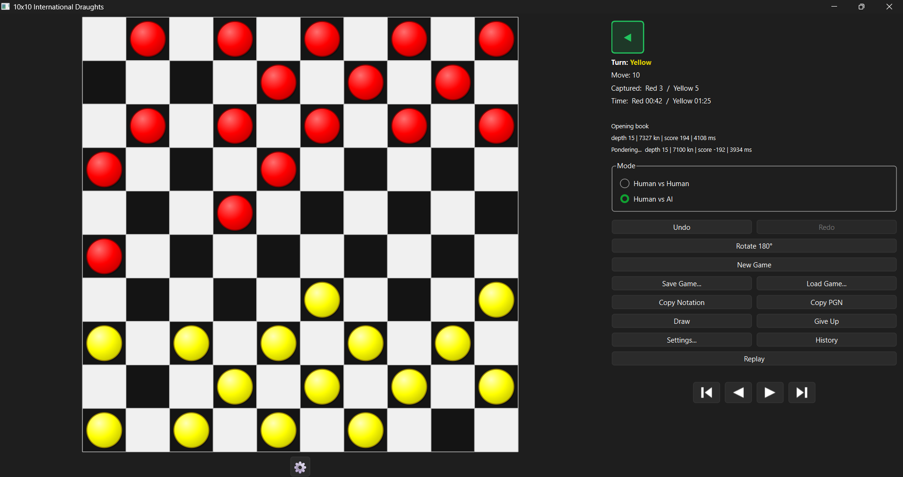
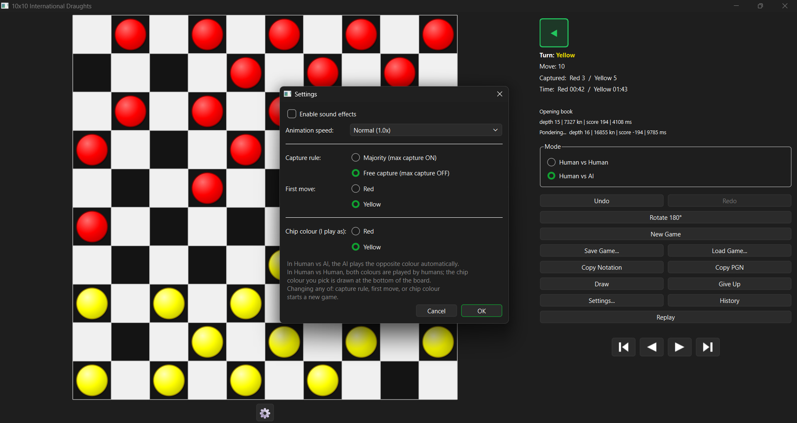
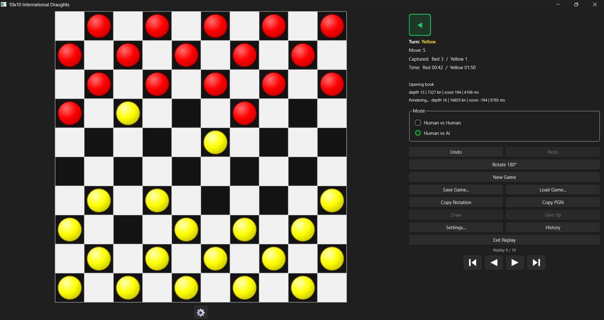

# 10x10 International Draughts

A production-grade 10x10 International Draughts game written in C++20 with a
Qt 6 front-end and a top-class alpha-beta search engine.

Features at a glance:

- Full FMJD International rules, both capture variants
- Smooth 60 FPS piece animations
- Non-blocking worker-thread AI (Lazy SMP)
- FMJD algebraic notation, save/load, copy notation
- Sound effects, undo/redo, full move history
- Depth 15-20 within 5 seconds

## Screenshots

**Board ? mid-game, Human vs AI**

**Settings ? capture rule, first move, chip colour**

**Replay mode ? step through any completed game**

## Features

### Rules engine (fully tested - 25 unit tests, perft 1-6 verified)

- 10x10 board, 50 playable black squares
- Men move and capture diagonally; men may capture backward but not move backward
- Flying kings - move and capture any distance along an empty diagonal
- Multi-jump capture chains; captured pieces are removed only at end-of-chain
- Promotion only when a man ENDS its move on the promotion row
- Majority rule (max-capture ON) and free-capture variant (max-capture OFF)
- Win/draw detection: no legal moves, resignation, 25-move rule, threefold
  repetition, 3-vs-1 king and 2-vs-1 king small-endgame draws

### AI engine

- Negamax with alpha-beta pruning, transposition table, killer/history ordering
- Iterative deepening with a 5-second default budget (soft 4.0 s, hard 5.5 s)
- Lazy SMP: 2-8 worker threads share one transposition table
- Hand-tuned piece-square tables and mobility heuristics
- Runs entirely on a worker thread - the UI never blocks
- Instant cancelation: Undo/Redo/New Game abort the search within milliseconds
- Forced-move fast path: positions with a single legal move play without searching

### UI (Qt 6)

- Left: board with anti-aliased pieces, subtle 3D shading, highlighted moves
- Right: turn indicator, move counter, captured-piece counter, AI stats
- History panel with FMJD algebraic notation (32-28, 28x19x10)
- Buttons: Undo, Redo, Rotate 180, New Game, Save Game, Load Game,
  Copy Notation, Give Up, Settings
- Settings: sound on/off, animation speed, capture rule (majority/free),
  first-move side (Red/Yellow), chip colour (Red/Yellow)
- Sound effects for move, capture, promotion, win (Qt Multimedia)
- Smooth piece-slide animations at 60 FPS
- Fully DPI-aware; resizable splitter layout

## Quick start (Windows)

### Prerequisites

| Tool             | Version   | Install                                            |
|------------------|-----------|----------------------------------------------------|
| Visual Studio    | 2022/2026 | https://visualstudio.microsoft.com/                |
| CMake            | 3.24+     | winget install Kitware.CMake                       |
| Qt 6             | 6.5+      | https://www.qt.io/download-qt-installer            |
| Git              | any       | winget install Git.Git                             |

Qt install: in the Qt Online Installer, tick ONLY the "MSVC 2022 64-bit"
component under Qt 6.x, plus the "Qt Multimedia" sub-component. You do NOT
need Qt Creator.

### Build

    cd C:\path\to\MyDraught
    cmake --preset windows-msvc
    cmake --build --preset windows-release
    ctest --preset windows-release-tests

If your Qt is installed somewhere other than
C:/MyCodeApp/Qt/6.11.2/msvc2022_64, edit CMAKE_PREFIX_PATH in
CMakePresets.json or override it:

    cmake -S . -B build -G "Visual Studio 18 2026" -A x64 ^
          -DCMAKE_PREFIX_PATH="C:/path/to/Qt/6.x.y/msvc2022_64"

### Run

    $env:PATH = "C:\MyCodeApp\Qt\6.11.2\msvc2022_64\bin;" + $env:PATH
    .\build\Release\draughts.exe

The $env:PATH line is only needed during development - a deployed install
copies the Qt DLLs alongside the exe using windeployqt.

## Quick start (Linux)

    sudo apt install build-essential cmake qt6-base-dev qt6-multimedia-dev
    cmake --preset linux-gcc-release
    cmake --build --preset linux-release
    ctest --preset linux-release-tests
    ./build/draughts

To build without Qt (engine only + tests):

    cmake -S . -B build -DDRAUGHTS_BUILD_UI=OFF
    cmake --build build -j
    ctest --test-dir build --output-on-failure

## Project layout

    draughts/
    |-- CMakeLists.txt          # single source of truth for the build
    |-- CMakePresets.json       # platform-specific configure/build/test presets
    |-- .clang-format           # project-wide formatting rules
    |
    |-- src/
    |   |-- core/               # pure rules engine - no GUI, no AI dependencies
    |   |   |-- Types.hpp              # Square, Piece, Color, PieceKind, Move
    |   |   |-- BoardConstants.hpp     # geometry, neighbours, rays, initial setup
    |   |   |-- RuleSet.hpp            # max-capture / free-capture variants
    |   |   |-- Zobrist.hpp/.cpp       # deterministic position hashing
    |   |   |-- Board.hpp/.cpp         # 50-square bitboard board
    |   |   |-- CaptureRules.hpp/.cpp  # capture chain expansion (both variants)
    |   |   |-- MoveGenerator.hpp/.cpp # legal move generation
    |   |   |-- GameState.hpp/.cpp     # turn, ply, repetition, draw counters
    |   |   |-- GameEngine.hpp/.cpp    # apply/undo/redo, terminal detection
    |   |   |-- Notation.hpp/.cpp      # FMJD algebraic notation
    |   |   |-- Perft.hpp/.cpp         # move-generation correctness harness
    |   |
    |   |-- ai/                 # search engine - depends on core only
    |   |   |-- PST.hpp                # piece-square tables (data only)
    |   |   |-- Evaluator.hpp/.cpp     # material, position, mobility
    |   |   |-- TimeManager.hpp/.cpp   # 5 s budget with soft/hard limits
    |   |   |-- TranspositionTable.hpp/.cpp  # striped-lock thread-safe TT
    |   |   |-- MoveOrdering.hpp/.cpp  # TT, killers, history, capture-first
    |   |   |-- Search.hpp/.cpp        # iterative deepening alpha-beta
    |   |   |-- AIEngine.hpp/.cpp      # SMP worker threads, done/progress callbacks
    |   |
    |   |-- ui/                 # Qt 6 widgets - depends on core, calls ai
    |   |   |-- Theme.hpp/.cpp              # single source for visual constants
    |   |   |-- PieceRenderer.hpp/.cpp      # chip + crown rendering
    |   |   |-- BoardWidget.hpp/.cpp        # board rendering and click handling
    |   |   |-- Animator.hpp/.cpp           # 60 FPS piece-slide animations
    |   |   |-- GameController.hpp/.cpp     # MVC glue, owns engine + AI
    |   |   |-- HistoryPanel.hpp/.cpp       # scrollable move list
    |   |   |-- SidePanel.hpp/.cpp          # turn status + buttons
    |   |   |-- SoundManager.hpp/.cpp       # move/capture/king/win SFX
    |   |   |-- Settings.hpp/.cpp           # QSettings-backed preferences
    |   |   |-- SettingsDialog.hpp/.cpp     # preferences dialog
    |   |   |-- SaveGame.hpp/.cpp           # text save/load (.drgt)
    |   |
    |   |-- controller/
    |   |   |-- ModeConfig.hpp              # HumanVsHuman / HumanVsAI
    |   |
    |   |-- main.cpp
    |
    |-- tests/                  # Catch2 unit tests + perft suite
    |-- tools/                  # perft CLI and AI diagnostics
    |-- data/
    |   |-- assets/sounds/      # move.wav, capture.wav, king.wav, win.wav

## Diagnostics

Three command-line tools are built alongside the game:

    # Perft node counts for both variants
    .\build\Release\perft.exe --depth 6 --rules on
    .\build\Release\perft.exe --depth 6 --rules off

    # Single AI search on the opening position, prints per-depth progress
    .\build\Release\ai_bench.exe

    # AI vs AI self-play at short time control
    .\build\Release\ai_selfplay.exe 30

    # Headless driver of the real GameController - proves the UI never blocks
    .\build\Release\ai_ui_sim.exe

## Documentation

| File                | Contents                                                 |
|---------------------|----------------------------------------------------------|
| RULES.md            | Both rule variants precisely specified                   |
| ARCHITECTURE.md     | Module layout and "write once, use everywhere" design    |
| AI_DESIGN.md        | Search algorithms, move ordering, evaluation, tuning     |
| THREADING.md        | UI <-> AI thread contract, cancelation and watchdog      |

## Testing

    ctest --test-dir build -C Release --output-on-failure

25 tests cover:

- Board coordinate round-trips and bitboard mutation
- Move generation for both rule variants (opening, captures, king chains)
- Promotion rules (man ends on row 9 / row 0; passing through does not promote)
- Flying-king behaviour (distance, blocking, capture landing squares)
- Zobrist incremental hashing vs. full recompute
- Perft depth 1-6 against published FMJD reference counts

## License

Placeholder - add your preferred license here (MIT, Apache-2.0, etc.) before
distributing.
